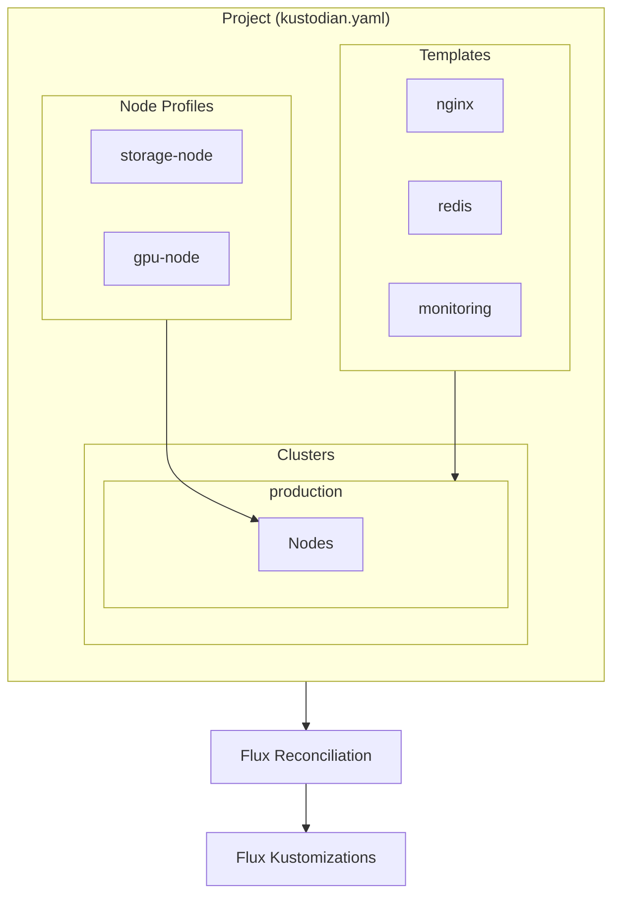

import { Card, CardGrid } from '@astrojs/starlight/components';

Kustodian is built around a few core concepts that work together to manage Kubernetes infrastructure declaratively.

## The Big Picture

## Key Concepts

<CardGrid>
  <Card title="Projects" icon="document">
    The root of a Kustodian configuration, identified by `kustodian.yaml`.
    [Learn more →](/concepts/projects/)
  </Card>
  <Card title="Templates" icon="puzzle">
    Reusable application definitions that can be deployed to any cluster.
    [Learn more →](/concepts/templates/)
  </Card>
  <Card title="Clusters" icon="rocket">
    Target environments where templates are deployed, with their own nodes and configuration.
    [Learn more →](/concepts/clusters/)
  </Card>
  <Card title="Nodes" icon="laptop">
    Kubernetes node definitions with roles, addresses, labels, and taints.
    [Learn more →](/concepts/nodes/)
  </Card>
  <Card title="Profiles" icon="setting">
    Reusable node configurations that reduce duplication and ensure consistency.
    [Learn more →](/concepts/node-profiles/)
  </Card>
  <Card title="Substitutions" icon="pencil">
    Variables that customize template behavior per-cluster.
    [Learn more →](/concepts/substitutions/)
  </Card>
</CardGrid>

## How They Work Together

1. **Profiles** define reusable node configurations (labels, taints, annotations)
2. **Nodes** reference profiles and add cluster-specific details
3. **Templates** define application deployments with kustomizations
4. **Clusters** select which templates to deploy and configure Flux settings
5. **Flux** generates Kustomization manifests in real-time during reconciliation

## Resource Types

| Kind | File Location | Purpose |
|------|--------------|---------|
| `Project` | `kustodian.yaml` | Identifies project root |
| `NodeProfile` | `node-profiles/*.yaml` | Reusable node config |
| `Template` | `templates/*/template.yaml` | Application definition |
| `Cluster` | `clusters/*/cluster.yaml` | Cluster configuration |
| `Node` | `clusters/*/nodes/*.yaml` | Node definition |

## Next Steps

Dive deeper into each concept:

- [Projects](/concepts/projects/) - Project configuration
- [Templates](/concepts/templates/) - Creating reusable templates
- [Clusters](/concepts/clusters/) - Cluster configuration
- [Nodes](/concepts/nodes/) - Node definitions
- [Node Profiles](/concepts/node-profiles/) - Reusable node profiles
